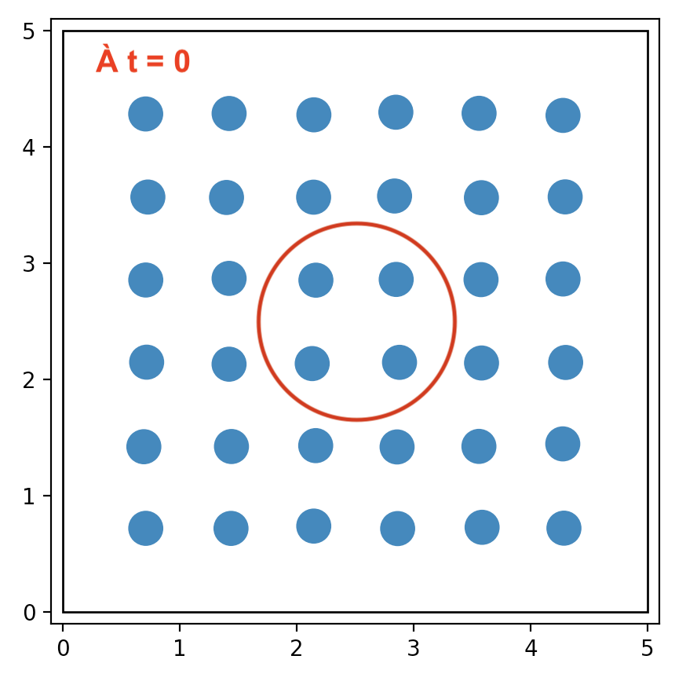
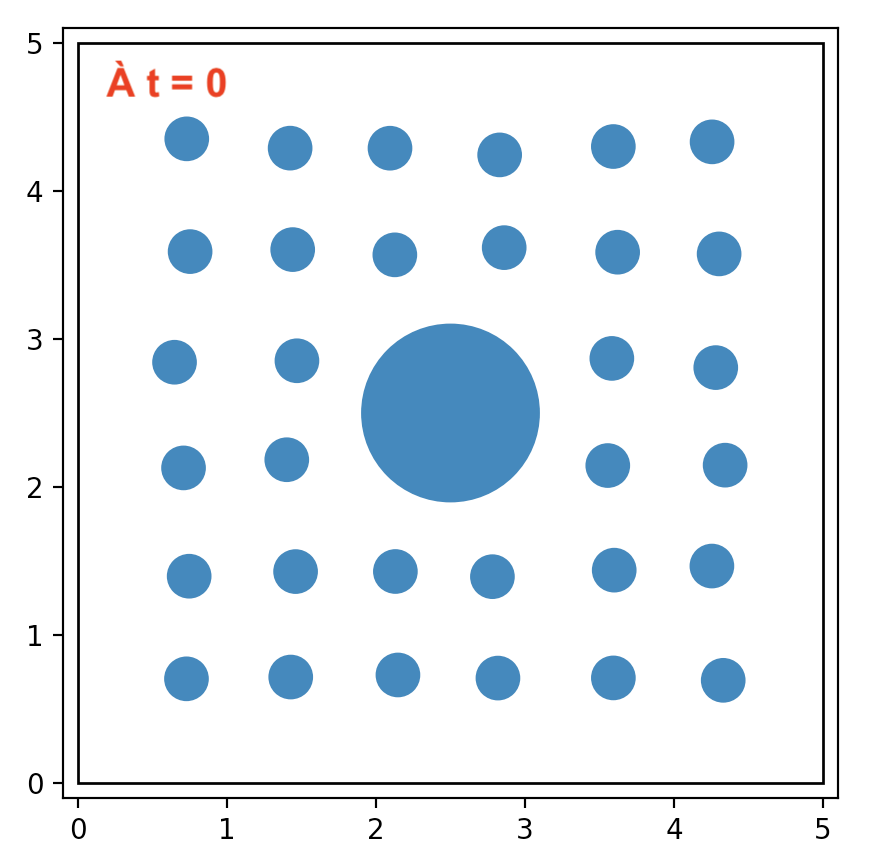
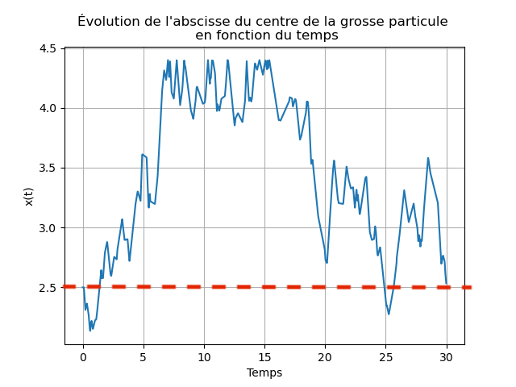
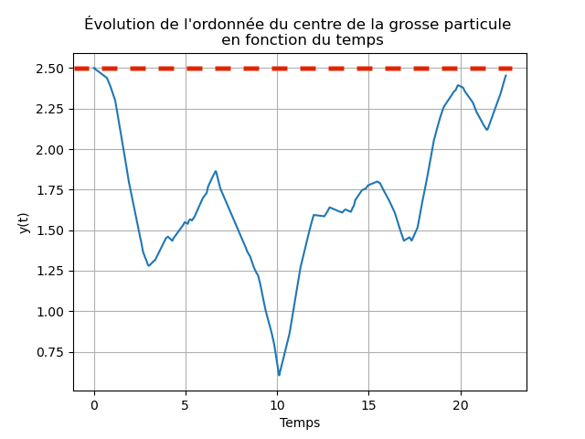
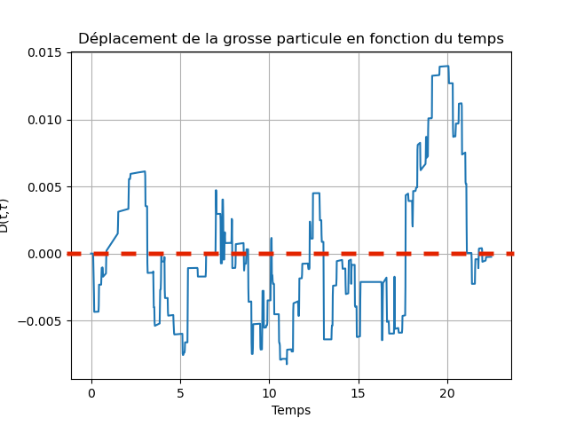
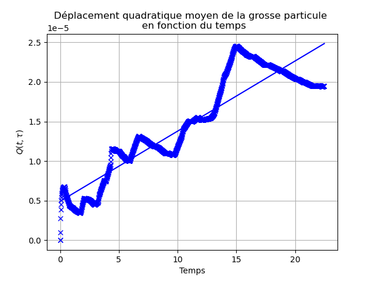
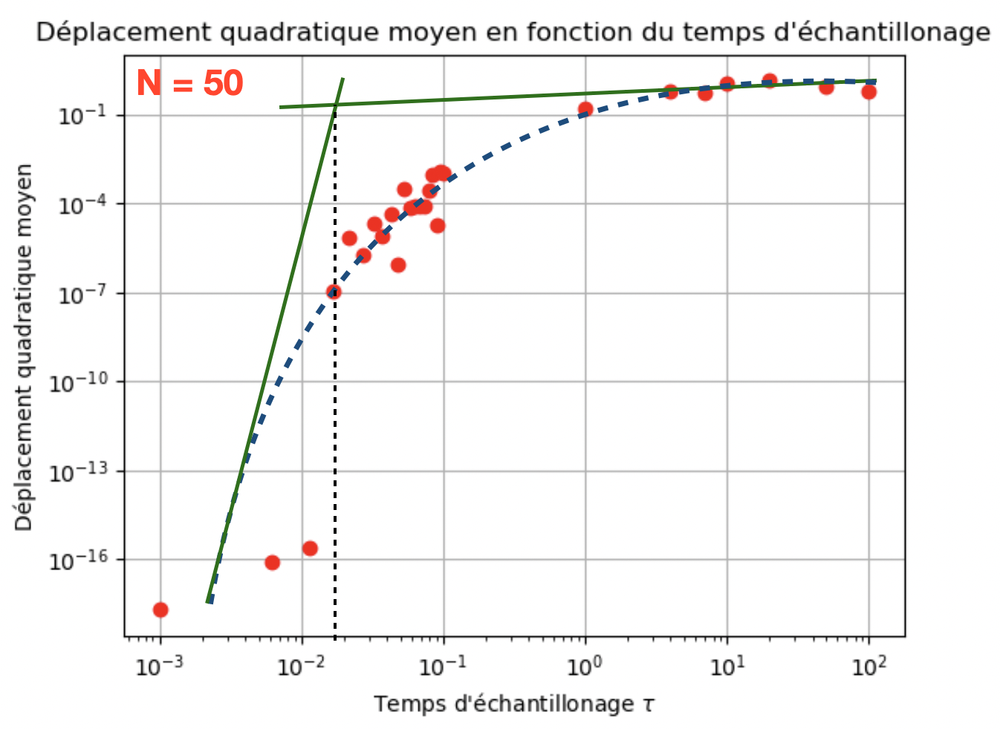
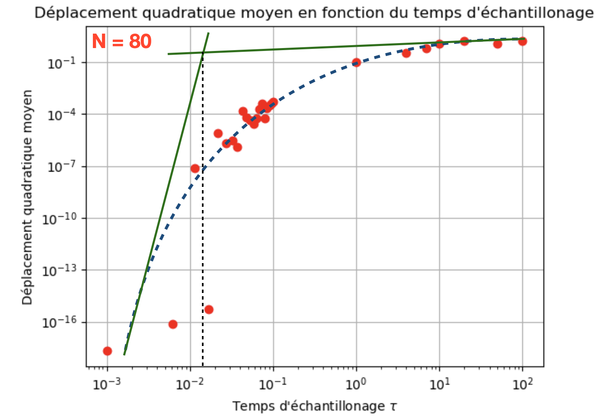
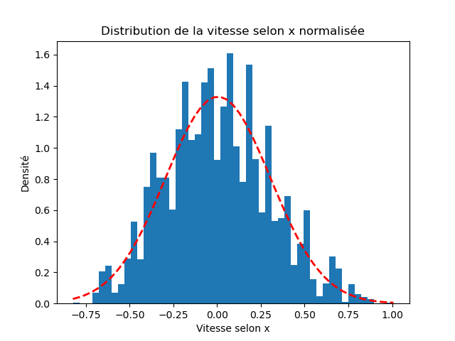
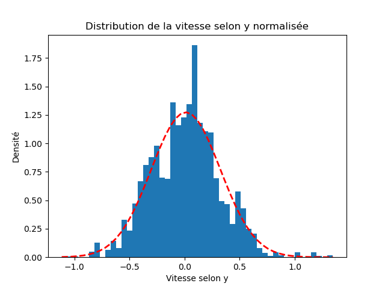

press `Ctrl + Shift + V` to view this file

# Rapport du TP de Simulation Numérique 
## Omar Benjelloun - 140ème

## Introduction

Lors des séances de TP de Simulation Numérique, nous avons eu l'occassion, dans un premier temps, de simuler les mouvements et collisions de N petites particules confinées dans une boite carrée (ou non). Dans ces simulations, on s'appuit sur un modèle de sphères dures : on attribue des vitesses aléatoires à chacune des particules de notre bain et on considère des chocs entre deux particules ou entre une particule et un mur sans déformation ou absorption d'énergie. Pour ce faire, nous avons implémenté un code reposant sur l'event-driven (Architecture Orientée Événements). Dans un tel système, la structure centrale de la solution repose sur la capture, la communication, le traitement et la persistance des événements, *ie* de tout phénomène ou changement d'état significatif au niveau du matériel ou d'un logiciel système. Dans notre cas, les événements correspondent à des collisions (entre deux particules ou en entre une particule et un mur) : le système de N particules est ainsi mis-à-jour après chaque événement. L'idée était alors d'exploiter cette simulation dans le but d'étudier un phénomène physique, dans notre cas le mouvement Brownien.

## Le projet : Brownian motion

Nous avons choisi de réaliser le projet **n°6** intitulé **"Brownian Motion"**. Le but de ce dernier était d'étudier le mouvement d'une grosse particule placée au sein d'un bain de petites particules. Nous avons donc eu pour idée de réutiliser la classe `simul` contenu dans le fichier `simul.py`. Pour cela, nous avons rédigé une "sous classe" de la classe `simul`, intitulée `Brownian` contenue dans le fichier `brownian_motion.py`. Cette sous classe permet de compléter la fonction `__init__` de la classe `simul` en y rajoutant les propriétés de la grosse particule. Pour que cela fonctionne, quelques modifications on du être apportées à la classe `simul` codée lors de la première partie du TP : 
- On transforme directement dans la classe `simul` le rayon scalaire **self.sigma** en liste de rayons, un pour chaque particule (on suppose ici que toutes les petites particules ont le même rayon, on peut aussi s'amuser à simuler avec plusieurs particules de plusieurs tailles, mais il faut pour cela modifier un peu la fonction `__init__`, ce que l'on ne fera pas). Cela induit quelques modifications dans les fonctions de la classe `simul`. Tout d'abord, `_wall_time` fait désormais intervenir des **self.sigma[k]**, rayon de la kième particule. Par ailleurs, cela a surtout une importance dans `_pair_time`. En effet, le terme de droite de l'équation quadratique ne s'écrit plus $2\sigma^2$ puisque les rayons des particules ne sont plus nécessairement identiques. On écrit donc le terme de droite de l'équation quadratique sous la forme $(\sigma_{parti} + \sigma_{partj})^2$. La sous-classe `Brownian` permet alors de rajouter le rayon de la grosse particule à la fin de cette liste de rayon **self.sigma**. 
- On crée, directement dans la fonction `__init__` de `simul`, une liste de masses des particules. Chaque particule peut donc potentiellement avoir une masse différente des autres. Cela implique une modification des équations régissant la vitesse d'une particule après collision avec une autre particule (dans `md_step`), un facteur faisant intervenir un rapport des masses apparait :

    $\begin{equation}
    \displaystyle
    v_{1'} =v_1 -\frac{2m_2}{m_1 + m_2}\hat{r} (\hat{r}  \cdot (v_1 - v_2) )\\ 
    \displaystyle
    {v}_2' =v_2 +\frac{2m_1}{m_1 + m_2}\hat{r} (\hat{r}  \cdot (v_1 - v_2) )\\
    \end{equation}$

 Il est alors possible dans la sous-classe `Brownian` de rajouter, à la liste des masses et des rayons des petites particules, la masse et le rayon de la grosse particule (bien que la masse dépend du rayon, dépendance en $R^3$, on la prend arbitrairement 10 fois plus importante). Considérer la différence des masses est absolument nécessaire si l'on souhaite étudier le mouvement Brownien. En effet, pour obtenir un déplacement quadratique de la grosse particule cohérent, l'inertie de cette dernière se doit d'être bien plus importante que celle des petites lors des collisions. On précise également que la grosse particule n'a pas de vitesse propre, et que son déplacement n'est dû qu'aux collisions avec les petites particules qui la percutent.

La sous-classe `Brownian` permet enfin de rajouter dans la liste des positions (**self.position**) la position de départ de la grosse particule, que l'on choisi de placer au centre de la "boite".  Cependant, dans la classe `simul`, à l'instant initial, les petites particules commencent dans une configuration ordonnées type cristal (voir figure de gauche ci-dessous). Donc, lorsque l'on rajoute la grosse particule, cette dernière vient se superposer aux petites particules au centre du cristal (entourées en rouge sur la figure de gauche ci-dessous). 
                                        
      

Dès lors, il nous a été nécessaire de rédiger dans la sous-classe `Brownian` une fonction intitulée `remove_center_particles`  prenant en entrée les listes de positions, rayons et masses des petites particules ainsi que la position du centre de la grosse particule et son rayon. Cette fonction permet de supprimer les petites particules se trouvant dans la zone de la grosse, *ie* les petites particules qui vérifient $(r_i - R)^2 \leq (S + s_i)^2~,$ où $r_i$ et $R$ sont les positions des centres de la petite particule i et de la grosse particule et $s_i$ et $S$ leurs rayons respectifs. On parvient de cette manière à éviter le recouvrement entre petites et grosse particules à l'instant initial, comme en témoigne la figure de droite ci-dessus. Cette méthode présente néanmoins un désavantage : si l'on souhaite observer un gaz de $N$ petites particules, et que l'on rentre dans le code la valeur $N$, seules ($N$ - nombre de petites particules se recouvrant avec la grosse particule) seront observées durant la simulation. Par exemple, sur la simulation ci-dessus à droite, on avait pris $N$ = 36 particules, et 4 particules sont éliminées car présentent dans la zone centrale : seules 32 particules seront exploitées dans la simulation.

On s'interesse désormais à l'étude du déplacement de la grosse particule au sein du bain de petites particules. Pour cela, le déplacement quadratique moyen de la grosse particule semblait un paramètre pertinent à étudier. On le définit par la formule suivante : Q($\tau$) =  <$[r(t+\tau)-r(t)]^2$>. Physiquement, cette quantité représente le rayon moyen de la sphère dans laquelle la grosse particule peut se déplacer entre les instants $t$ et $t + \tau$. Pour le calculer, nous avons décomposer la démarche en plusieurs étapes :
- Dans un premier temps, nous avons modifié la fonction `md_step` de la classe `simul` de manière à ce qu'elle renvoie en sortie la position de la grosse particule (**self.position[-1]**). Il faut bien faire attention à l'endroit dans la fonction `md_step` où l'on récupère cette position : on souhaite la récupérer à intervalle de temps régulier, le temps d'échantillonage (**self.sample_time**), on la prend donc en sortie de la boucle *while* de la fonction *md_step*.

- Dans un second temps, nous avons rédigé une fonction `position_big_part`, contenue dans le fichier `plot.py`, permettant de réaliser un certain nombre d'itérations de la fonction `md_step` et donc de récupérer à chaque itération la position de la grosse particule. Chaque position ainsi obtenue étant séparée par le temps d'échantillonage, la fonction crée une liste de temps multiples successifs du temps d'chantillonage. La position de la grosse particule peut d'ores et déjà être visualisée en fonction du temps sur les graphes ci-dessous.

       

    *Paramètres de la simulation : R = 0.6, M = 10, $N$ = 50, r = 0.15, m = 1,  L = 5 ; 1500 itérations, $t_{ech}$ = 0.015.*

    La grosse particule part de la position (2.5,2.5) (centre du réservoir) et au bout d'un temps suffisament long, elle revient à cette position. Ces graphes permettent donc de mettre en évidence une caractéristique très importante du mouvement Brownien : l'hypothèse d'isotropie spatiale. Toutes les directions de l'espace physique étant a priori équivalentes, la particule peut choisir de se déplacer soit vers la gauche (*resp.* vers le haut), soit vers la droite (*resp.* vers le bas) (à 1D). Chacun des graphes ci-dessus peuvent d'ailleurs être assimilé à des expériences de marches aléatoires à une dimension (selon x ou selon y), dans lesquelles la particule à la même probabilité de faire un saut vers la gauche (*resp.* vers le haut) et vers la droite (*resp.* vers le bas). Il est a noter que la fonction `position_big_part` prend en entrée l'index de la liste des temps auquel on souhaite commencer à stocker les abscisses et ordonnées de la grosse particule. Cela peut-être interessant si l'on souhaite que le système "oublie" sa configuration de départ, qui est très particulière (configuration de type cristal). Jusqu'à la fin, on fixe cet indice à 0.

- Pour continuer d'avancer vers le calcul du déplacement quadratique moyen, on cherche maintenant à calculer la quantité $D(t,\tau) = r(t+\tau)-r(t)$, correspondant au déplacement de la grosse particule pendant la durée $\tau$, qui, dans notre cas, correspond au temps d'échantillonage. On rédige ainsi la fonction `dep_big_part` dans le fichier `plot.py`, qui réutilise la fonction `position_big_part` pour calculer la différence des normes des vecteurs positions de la grosse particule à deux instants successifs. On obtient de cette manière la courbe présentée ci-dessous (en utilisant les mêmes paramètres que pour les deux courbes précédentes).  

    

    Le déplacement de la grosse particule oscille autour de 0 (en restant très proche de 0), ce qui prouve que du fait du caractère aléatoire et totalement isotropique du mouvement, le déplacement de la particule est nul (ou quasi nul) en moyenne. Qualitativement, si l'on suit la grosse particule au cours du temps, le barycentre de sa trajectoire correspond à son point de départ, elle « virevolte » donc autour du même point.

- On peut enfin s'interesser au déplacement quadratique moyen de la particule, calculé à l'aide de la fonction `dep_quad_moy_big_part` du fichier `plot.py`. On y réalise $N$ itérations de la fonction `md_step`, pour lesquelles on calcul le déplacement $D(t,\tau)$, que l'on stock dans une liste, et on calcule la moyenne de cette liste : on obtient donc pour un temps t donné le déplacement quadratique moyen de la grosse particule, qui dépend des déplacements quadratiques non moyens calculés entre l'instant 0 (*resp* $t_{initial}$ si l'index temporel de début de stockage des positions est non nul) et l'instant t. Observons ci-dessous l'évolution du déplacement quadratique moyen en fonction du temps (mêmes paramètres que précédement).

    

    On constate que le déplacement quadratique moyen est à-peu-près linéaire par rapport au temps. Cette linéarité est plutôt logique puisque l'on peut montrer que le déplacement quadratique moyen $Q(\tau) = <D(t)^2> = 2d\alpha t$, avec $d$ la dimension du mouvement (ici d = 2, le mouvement est plan), $\alpha$ le coefficient de diffusion, et t le temps écoulé. Dès lors, puisque l'on a l'équation de la droite bleue : $D(t) = 8.86.10^{-7}\times t + 4.92.10^{-6} \simeq 8.86.10^{-7}\times t$, on déduit le coefficient de diffusion $\alpha = \frac{8.86.10^{-7}}{4} = 2.22.10^{-7}$ USI. 

    Par ailleurs, interessons nous à l'expression du déplacement quadratique $Q(\tau)$ dans deux cas limites : 
    - Si $\tau \longrightarrow 0$, alors Q($\tau$) $\simeq$ $\displaystyle<\left[\frac{dr}{dt}\tau\right]^2>$ = $\tau^2<v^2>$. Considérer ce cas revient enfaite à considérer ce qu'il se passe entre deux collisions. En effet, si $\tau$ est petit, alors $\tau$ $\leq$ $t_{collision}$, avec $t_{collision}$ le temps séparant deux collisions successives de la grosse particule avec de petites particules. Entre deux collisions, le mouvement de la grande particule est totalement déterminé : elle se déplace en ligne droite à une vitesse constante (mouvement rectiligne uniforme). Ce régime est appelé **le régime balistique**.
    - Si $\tau \longrightarrow +\infty$, on regarde ce qu'il se passe après un grand nombre de collisions (cette fois $\tau$ $\geq$ $t_{collision}$) : le mouvement est cette fois probabiliste. Posons $R = \sum_{i}r_i$, la somme des petits déplacements $r_i$ de la grosse particule entre chacune de ces collisions avec le bain de petites particules. On peut alors écrire que $<R^2> = <\left(\sum_{i}r_i\right)\left(\sum_{j}r_j\right)> = <\left(\sum_{i}r_i^2\right) + \left(\sum_{i \neq j}r_ir_j\right)> = <\left(\sum_{i}r_i^2\right)>$ car par isotropie, $<r_ir_j>$ = 0 si $i\neq j$. Finalement, $<R^2> = \left(\sum_{i}<r_i^2>\right) = Nl^2$, avec N le nombre de collisions pendant $\tau$ et l = $\sqrt{<r_i^2>}$ le libre parcours moyen de la grosse particule. Enfin, si l'on pose $\tau_m$ le temps typique entre deux collisions, alors on a $\displaystyle N = \frac{\tau}{\tau_m}$ et donc $\displaystyle<R^2> = \frac{l^2}{\tau_m^2}\tau_m\tau = <v^2>\tau_m\tau$. D'où finalement, $Q(\tau) = \alpha\tau$, avec $\alpha$ un facteur de proportionalité. Ce régime est appelé **le régime diffusif**.

    Pour observer les régimes balistique et diffusif à l'aide de notre simulation, il suffit de faire varier le temps d'échantillonage, qui correspond à $\tau$. Pour le régime ballistique, c'est assez simple, il suffit de prendre de petits $t_{ech}$, le calcul des déplacements quadratiques moyens est rapide et on peut faire un grand nombre d'itérations de la fonction `md_step`. Par contre, le régime diffusif est beaucoup plus difficile à observer. En effet, il faut augmenter de manière importante le temps d'échantillonage (autour de 20 et plus), donc le nombre de collisions que le code doit calculer est beaucoup plus important et la simulation dure beaucoup plus longtemps : le calcul est donc très long pour chaque itération de `md_step`. On ne peut donc pas réaliser un grand nombres d'itérations. Or, puisque les déplacements quadratiques moyens à faible et grand temps d'échantillonage doivent être calculés à nombre d'itérations égal, on fait le choix d'itérer seulement 10 fois la fonction `md_step`. Le déplacement quadratique moyen que l'on étudie est la moyenne des déplacements quadratiques de la grosse particule sur ces 10 itérations. Si l'on prend 50 particules, et que l'on fait varier le temps d'échantillonage entre 0.001 et 100, on obtient la courbe de gauche ci-dessous, en échelle log-log. Sur cette dernière figure le modèle quadratique du régime balistique en pointillé bleu et les asymptotes en $\pm \infty$. 

     

    On constate que l'approximation quadratique dans le régime balistique se vérifie très bien. Il en va de même du régime diffusif : pour des $\tau$ grands (environ à partir de 1), le déplacement quadratique évolue de manière affine par rapport au temps d'échantillonage. Par ailleurs, on peut également s'intéresser au point de rupture en fonction du nombre de particules entre ces deux régimes, que l'on caractérise par l'abscisse du point d'intersection des asymptotes en $\pm \infty$. En effet, plus il y a de particules, plus le libre parcours moyen de la grosse particule est faible puisque le risque de collision avec une petite particule est important sur des temps courts : l'on rentre rapidement dans le régime diffusif. Ainsi, plus le nombre de particules est important, plus le $\tau_{limite}$ séparant les deux régimes et faible : c'est ce que l'on observe ci-dessus : $\tau_{limite}$ est plus faible à droite avec 80 particules qu'à gauche avec 50 (*Remarque : la simulation pour 80 particules a mis plus de 3h30 à se réaliser, d'où l'interêt de ne pas itérer trop de fois*).

Pour finir, il semblait pertinent de s'interesser à la distribution des vitesses $v_x$ et $v_y$ de la grosse particule au cours d'un certain nombre d'itérations de la fonction `md_step`. Intuitivement, on peut s'attendre à ce que chaque composante de vitesse suive une loi de Boltzmann de la forme $P(v) \propto exp\left(-\frac{v^2}{2\sigma ^2}\right)$. On va donc tracer, à l'aide de la fonction `velocity_big_part` du fichier `plot.py` la distribution normalisée de $v_x$ et $v_y$ pour 10000 répétitions, 50 particules puis l'on fit l'histogramme obtenu avec une Gaussienne. On obtient de cette manière les histogrammes suivants.

 

On constate que le fit Gaussien semble très bien adapé. On modélise donc les distributions normalisées par des distributions Gaussiennes centrées de moyenne $\mu$ = $\pm$ 0.023 $\simeq$ 0 et d'écart type $\sigma \simeq 0.33$ (pour $v_x$ et $v_y$ ). On obtient donc finalement la distribution de vitesse non normalisée sous forme analytique : $\displaystyle P(v) = \frac{1}{\sigma}exp\left(-\frac{v^2}{2\sigma ^2}\right)$. Cela correspond à ce que l'on attendait. On observe par ailleurs (l'image n'est pas présentée ici) que la distribution des vitesses ne dépend pas du nombre de particule dans la boite (on obtient exactement le même résultat en utilisant 80 particules à la place de 50), ce qui peut paraitre étonnant mais correspond bien aux observations expérimentales.

## Conclusion

Pour conclure, notre simulation nous a permis de mettre en évidence un certain nombre de caractéristiques du mouvement Brownien. Cependant, le mouvement que nous avons étudié ici n'était pas un mouvement purement Brownien, puisqu'il prenait en compte les collisions de la grosse particule avec les parois du réservoir. L'idée que nous avions alors eu consistait à imposer une condition périodique au bord. Autrement dit, lorsque la grosse particule rentre en collision avec une paroi, elle traverse cette dernière est ressort sur la paroi opposée. Cela permettait de s'affranchir des chocs sur les parois et de simuler le mouvement de la grosse particule plongée dans un bain de petite particule en milieu infini. Néanmoins, si la densité de particule est suffisament élévée, le nombre de collisions entre le mur et la grosse particule est négligeable pour des temps de simulation relativement courts (ce qui est le cas ici, on simule rarement plus de 5000 itérations). Cette condition périodique n'était donc pas nécessaire à mettre en place. Par ailleurs, il aurait pu être interessant de rajouter (sous réserve d'une légère modification du code, voir plutôt de la création d'une nouvelle sous-classe de `simul`) une seconde particule. Cela nous aurait permis d'étudier le phénomène de déplétion qui découle de l'interaction entre deux macromolécules dans un bain de petites sphères et ainsi de nous interesser à la distance au cours du temps entre les deux particules, à la fonction d'interaction de paire et au potentiel d'interaction effectif. Enfin, la dernière partie du projet qui consistait à placer les petites particules au sein de la grosse particule n'a pas été réalisé par manque de temps. L'idée pour placer les petites particules dans la grosse et les faire rebondir sur sa paroi est d'une difficulté moyenne, mais la gestion des collisions  entre les petites particules et celles de la grosse particule avec les parois était plus difficile à implémenter.

